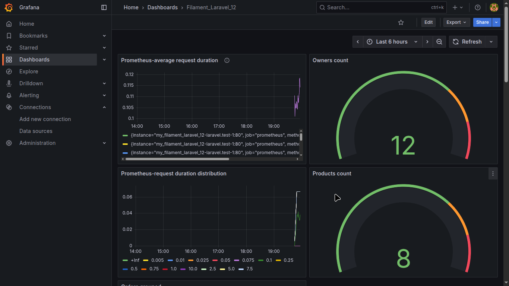
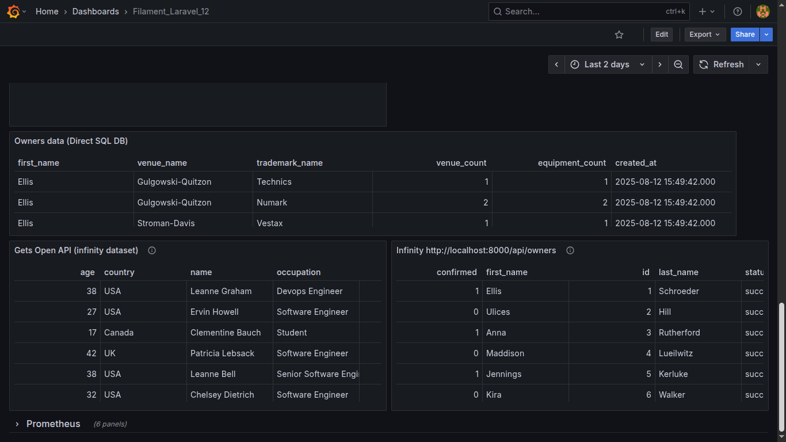
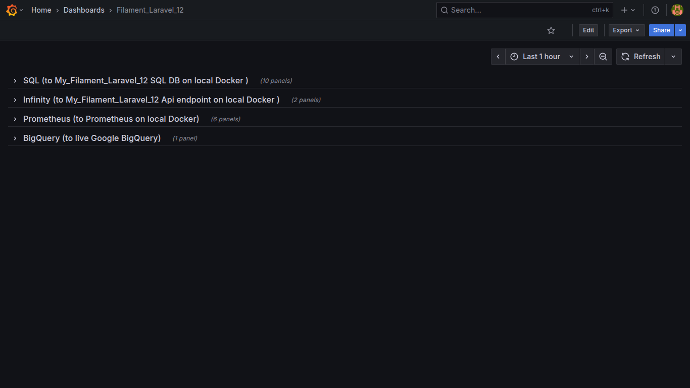

 Both prometheus and grafana  

<code> docker compose up -d </code>  OR <code> docker-compose up -d </code>

Access Prometheus: http://localhost:9090  OR  UI => http://localhost:9090/targets   

Access Grafana: http://localhost:3000 (default login: admin / admin)                    

  

 How connect Grafana and Prometheus to my_filament_laravel_12 (need to run every time). Variant 1. Spoiler: use Variant 2 

Connect Grafana to Laravel Filament sql container and set Grafana datasource, create one network 'filament-net':
<code> docker network connect filament-net grafana  </code>
<code> docker network connect filament-net my_filament_laravel_12-mysql-1 </code>
Grafana SQL datasource set up for SQL:  Host:	my_filament_laravel_12-mysql-1:3306  

  

------------------------------------------------

------------------------------------------------

 

 Connect SQL dataset 
 
Configure new Data source for SQL  
Host URL: my_filament_laravel_12-mysql-1:3306
Database name: laravel_filament

------------------------------------------------

 

 How connect Grafana/Prometheus and Laravel. Variant 2, USE IT!!! : 
   since 'sail' network is already created by Laravel-filament_12  
 
Install plugin Prometheus 
Prometheus server URL:  http://prometheus:9090
You still need to manually connect containers (docker network connect) because the containers are not started from the same docker-compose.yml file, so Docker doesn't automatically attach them to shared networks unless explicitly declared and correctly named.

<code>
docker network connect sail my_filament_laravel_12-mysql-1               
docker network connect sail my_filament_laravel_12-laravel.test-1        
</code>

 

Connect Prometheus and Laravel to same network 'filament-net'.               
docker network connect filament-net my_filament_laravel_12-laravel.test-1    
docker network connect filament-net prometheus                               
Then in prometheus.yml =>  targets: ['laravel-container-name:8000']          
Grafana Prometheus datasource set up:  Prometheus server URL :	http://prometheus:9090   

  
------------------------------------------------

 

 Connect Infinity dataset 
 
Install plugin yesoreyeram-infinity  
Go inside Filament Laravel container and run =>    php artisan serve --host=0.0.0.0 --port=8000   
Now can use Docker open URL =>  http://my_filament_laravel_12-laravel.test-1:8000/api/owners         
In Parsing options =>  in Rows/Root set =>  $.data  

2. Way to query Sanctum protected Api route:  
 generate token in tinker or console or anywhere else -> go to Data Source (cant configure for Panel only, but for all Data source) -> Auth -> Bearer token -> insert token. You might additionally need to go to => Security => and add to 'Allowed hosts' your 'http://my_filament_laravel_12-laravel'.test-1:8000

 

------------------------------------------------

 

 Connect BigQuery dataset 
 
Install new connection: 'Google BigQuery' -> config new datasource 'Google BigQuery'  -> add JWT file (it will load 'Project ID', 'Token URI') -> click 'Save and test'

Make sure to enable 'Cloud Resource Manager API'  in https://console.cloud.google.com/apis/library/cloudresourcemanager.googleapis.com

# BigQuery query example, top 2 most viwed, use Bar chart and set x-axis as total_views
 SELECT 
 product_id, 
 COUNT(product_id) AS total_views 
 FROM analytics_dataset.product_views  #datasetName.tableName
 GROUP BY product_id 
 ORDER BY total_views DESC 
 LIMIT 2

 
------------------------------------------------

  

Command to enter Grafana container:   <code> docker exec -it grafana sh </code>   

Command to enter Filament sql container: <code> docker exec -it my_filament_laravel_12-mysql-1 bash </code>

 ----------------------------------------------------------------------------------------- 

## 103. Screenshots
   
   
   
   