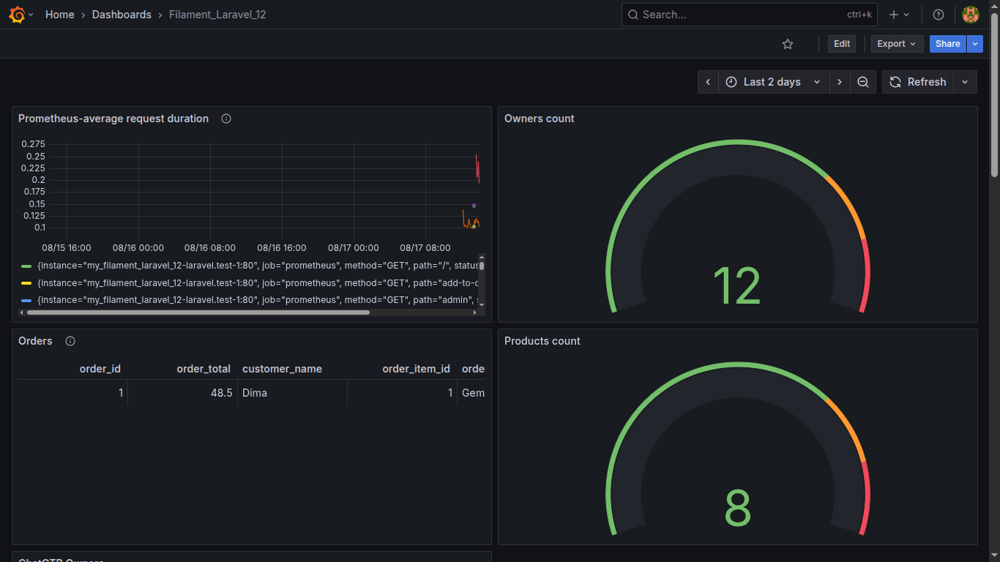

 Both prometheus and grafana  

<code>docker compose up -d </code>  OR <code> docker-compose up -d </code>

Access Prometheus: http://localhost:9090  OR  UI => http://localhost:9090/targets   

Access Grafana: http://localhost:3000 (default login: admin / admin)                    

  

 How connect Grafana and Prometheus to my_filament_laravel_12 (need to run every time) 

Connect Grafana to Laravel Filament sql container and set Grafana datasource, create one network 'filament-net':
<code> docker network connect filament-net grafana  </code>
<code> docker network connect filament-net my_filament_laravel_12-mysql-1 </code>
Grafana SQL datasource set up for SQL:  Host:	my_filament_laravel_12-mysql-1:3306  

  

Connect Prometheus and Laravel to same network filament-net'                 
docker network connect filament-net my_filament_laravel_12-laravel.test-1    
docker network connect filament-net prometheus                               
Then in prometheus.yml =>  targets: ['laravel-container-name:8000']          
Grafana Prometheus datasource set up:  Prometheus server URL :	http://prometheus:9090   

  

Connect Infinity dataset  
Go inside Laravel container and run =>    php artisan serve --host=0.0.0.0 --port=8000   
Now can use URL =>  http://my_filament_laravel_12-laravel.test-1:8000/api/owners         
In Parsing options =>  in Rows/Root set =>  $.data

  

Command to enter Grafana container:   <code> docker exec -it grafana sh </code>   

Command to enter Filament sql container: <code> docker exec -it my_filament_laravel_12-mysql-1 bash </code>

 ----------------------------------------------------------------------------------------- 

## 103. Screenshots
   
   
   